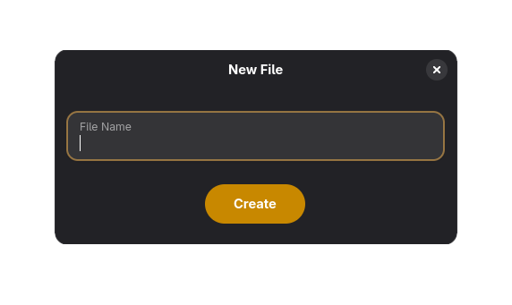

# nautilus-newfile
Adds a "New File..." option to the context menu of nautilus

### Installation
Copy both `nautilus-newfile.py` and `new-file-dialog.ui` to `~/.local/share/nautilus-python/extensions`
### Limitations
- No filename validation is run (needs implementation)
- Modal is not attached to the nautilus window (limitation of the nautilus extensions api)
- The newly created file is not automatically selected (limitation of the nautilus extensions api)